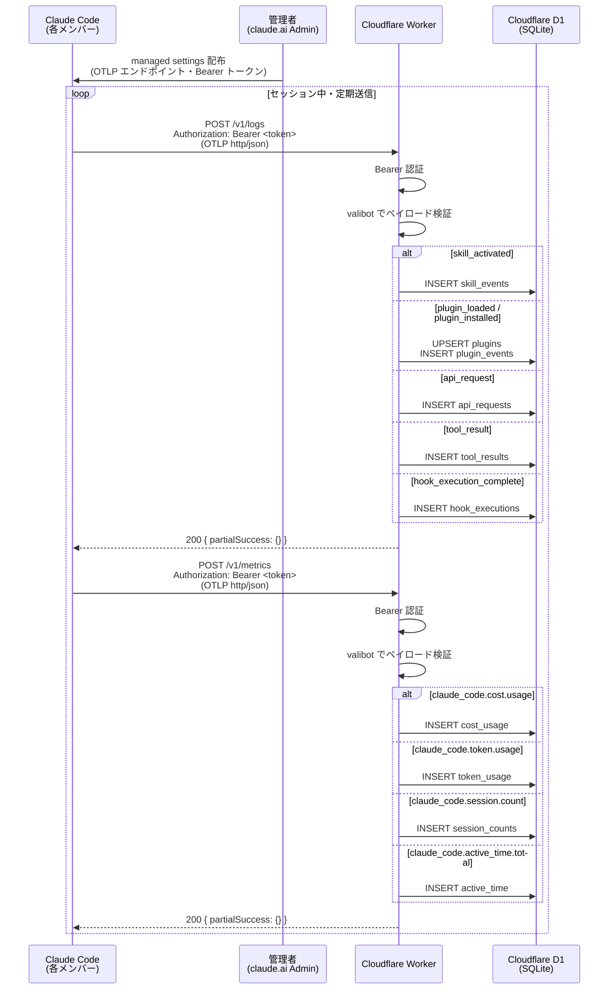
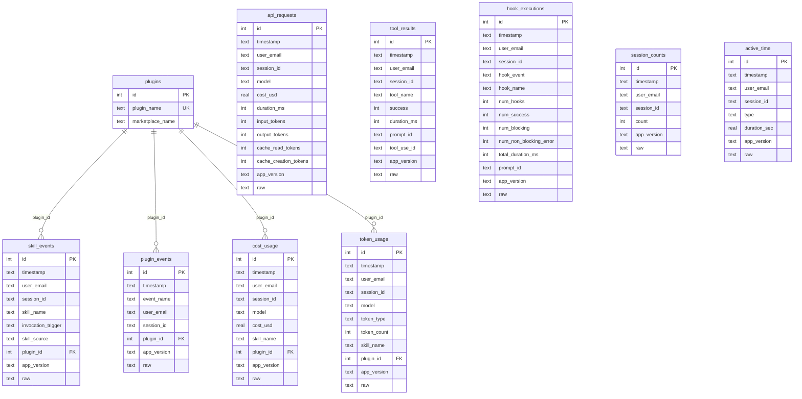

# cc-monitor-worker

Claude Code の Skill 利用状況を収集する Cloudflare Worker。
各メンバーの Claude Code クライアントが OTLP(OpenTelemetry Protocol)形式でログ・メトリクスを自動送信し、Cloudflare D1(SQLite)に蓄積する。

## アーキテクチャ

```
各メンバーの Claude Code
  ↓ POST /v1/logs・/v1/metrics(OTLP http/json)
  ↓ Authorization: Bearer <token>
Cloudflare Worker(このリポジトリ)
  ↓ Bearer 認証 → valibot でペイロード検証 → イベント種別で振り分け
Cloudflare D1(SQLite)
  ├── plugins          プラグインマスタ
  ├── skill_events     Skill 起動ログ
  ├── plugin_events    プラグイン ロード・インストール履歴
  ├── api_requests     API リクエストログ
  ├── tool_results     ツール実行ログ
  ├── hook_executions  フック実行ログ
  ├── cost_usage       コストメトリクス(USD)
  ├── token_usage      トークン消費メトリクス
  ├── session_counts   セッション数メトリクス
  └── active_time      アクティブ時間メトリクス
```

メンバー側の作業は不要。管理者が claude.ai Admin Settings で managed settings を配布するだけで自動収集が始まる。

### システムフロー



### ER 図



## 収集するデータ

| イベント | エンドポイント | 格納先 |
|---|---|---|
| `skill_activated` | `/v1/logs` | `skill_events` |
| `plugin_loaded` / `plugin_installed` | `/v1/logs` | `plugin_events` |
| `api_request` | `/v1/logs` | `api_requests` |
| `tool_result` | `/v1/logs` | `tool_results` |
| `hook_execution_complete` | `/v1/logs` | `hook_executions` |
| `claude_code.cost.usage` | `/v1/metrics` | `cost_usage` |
| `claude_code.token.usage` | `/v1/metrics` | `token_usage` |
| `claude_code.session.count` | `/v1/metrics` | `session_counts` |
| `claude_code.active_time.total` | `/v1/metrics` | `active_time` |

## セットアップ

### 1. 依存関係インストール

```bash
bun install
```

### 2. Bearer トークン生成・登録

```bash
# トークン生成
openssl rand -base64 32

# Cloudflare に登録(デプロイ後も永続される)
bunx wrangler secret put OTEL_BEARER_TOKEN
```

### 3. ローカル開発用設定

`.dev.vars` を作成(Git 管理外):

```
OTEL_BEARER_TOKEN=任意の値
```

### 4. DB マイグレーション

```bash
# ローカル
bun run db:migrate:local

# 本番
bun run db:migrate:remote
```

### 5. デプロイ

```bash
bun run deploy
```

## Claude Code クライアント側の設定

### Teams / Enterprise: managed settings(推奨)

claude.ai の Admin Settings > Claude Code > Managed settings に投入する JSON。  
メンバーの Claude Code が起動時・1時間ごとに自動受信するため、個別連絡は不要。

```json
{
  "env": {
    "CLAUDE_CODE_ENABLE_TELEMETRY": "1",
    "OTEL_LOG_TOOL_DETAILS": "1",
    "OTEL_LOGS_EXPORTER": "otlp",
    "OTEL_METRICS_EXPORTER": "otlp",
    "OTEL_METRICS_INCLUDE_VERSION": "true",
    "OTEL_EXPORTER_OTLP_PROTOCOL": "http/json",
    "OTEL_EXPORTER_OTLP_ENDPOINT": "https://cc-monitor-worker.<account>.workers.dev",
    "OTEL_EXPORTER_OTLP_HEADERS": "Authorization=Bearer <登録したトークン>"
  }
}
```

### 個人プラン・自分だけ収集したい場合

`~/.claude/settings.json` に追記する。既存の設定がある場合は `env` キーをマージする。

```json
{
  "env": {
    "CLAUDE_CODE_ENABLE_TELEMETRY": "1",
    "OTEL_LOG_TOOL_DETAILS": "1",
    "OTEL_LOGS_EXPORTER": "otlp",
    "OTEL_METRICS_EXPORTER": "otlp",
    "OTEL_METRICS_INCLUDE_VERSION": "true",
    "OTEL_EXPORTER_OTLP_PROTOCOL": "http/json",
    "OTEL_EXPORTER_OTLP_ENDPOINT": "https://cc-monitor-worker.<account>.workers.dev",
    "OTEL_EXPORTER_OTLP_HEADERS": "Authorization=Bearer <登録したトークン>"
  }
}
```

## 開発コマンド

| コマンド | 内容 |
|---|---|
| `bun run dev` | ローカルサーバー起動 |
| `bun run ai-check` | format + lint + 型チェック |
| `bun run db:generate` | スキーマ変更からマイグレーション生成 |
| `bun run db:migrate:local` | ローカル D1 にマイグレーション適用 |
| `bun run db:migrate:remote` | 本番 D1 にマイグレーション適用 |
| `bun run deploy` | 本番デプロイ |

## D1 クエリ例

```sql
-- Skill 別の使用回数
SELECT skill_name, COUNT(*) AS cnt FROM skill_events
GROUP BY skill_name ORDER BY cnt DESC;

-- ユーザー別・Skill 別
SELECT user_email, skill_name, COUNT(*) AS cnt FROM skill_events
GROUP BY user_email, skill_name ORDER BY cnt DESC;

-- Plugin 別のコスト合計
SELECT p.plugin_name, SUM(c.cost_usd) AS total_usd
FROM cost_usage c
JOIN plugins p ON c.plugin_id = p.id
GROUP BY p.plugin_name ORDER BY total_usd DESC;
```

## 新しいメトリクス・イベントの追加

Claude Code が送信するメトリクス・イベントのうち、現在未収集のものを追加する手順。既存コードへの変更は不要で、すべて追加のみ。

### メトリクス追加(`/v1/metrics`)

1. `src/db/schema.ts` — テーブル定義と Insert 型を追加
2. `src/lib/otlp.ts` — `METRIC` 定数にメトリクス名を追加
3. `src/routes/metrics.ts` — `if (metricName === METRIC.XXX)` の分岐を追加
4. マイグレーション生成・適用

```bash
bun run db:generate
bun run db:migrate:local   # 動作確認後
bun run db:migrate:remote  # 本番反映
```

### イベント追加(`/v1/logs`)

1. `src/db/schema.ts` — テーブル定義と Insert 型を追加
2. `src/lib/otlp.ts` — `EVENT` 定数にイベント名を追加
3. `src/routes/logs.ts` — `if (eventName === EVENT.XXX)` の分岐を追加
4. マイグレーション生成・適用(上記と同様)

## トークンのローテーション

漏洩時は以下の手順で更新する:

1. `bunx wrangler secret put OTEL_BEARER_TOKEN` で新しい値を登録
2. claude.ai Admin Settings の managed settings を新しいトークンで更新
